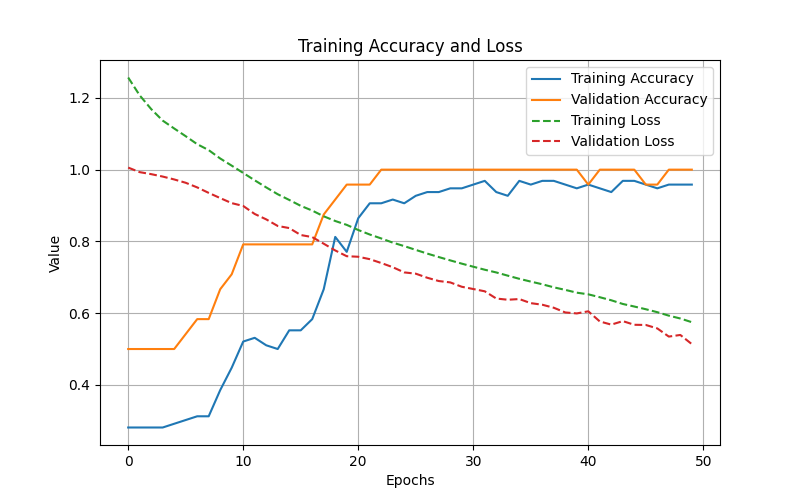

# 🌸 Iris Flower Classification using TensorFlow  
### 👨‍💻 Created by HARSHAD NABISAB MULLA  

---
# Iris TensorFlow Project

This project uses a **TensorFlow neural network** to classify iris flowers into three species: *Setosa*, *Versicolor*, and *Virginica*. It uses the classic **Iris dataset** and visualizes training performance with a plot.

---

## Project Structure

Iris-TensorFlow-Project/
│
├─ .vscode/ # Optional VSCode settings
├─ .gitignore
├─ README.md # Project instructions (this file)
├─ iris_model.py # Main Python code
├─ requirements.txt # Dependencies
├─ training_plot.png # Example training output

yaml
Copy code

---

## Setup Instructions

### 1️⃣ Windows (PowerShell)

```powershell
# Create virtual environment (Python 3.11 recommended)
py -3.11 -m venv venv

# Activate virtual environment
.\venv\Scripts\Activate.ps1

# Upgrade pip
python -m pip install --upgrade pip

# Install dependencies
pip install -r requirements.txt

# Run the project
python iris_model.py
2️⃣ Linux / Mac (Bash)
bash
Copy code
# Create virtual environment (Python 3.11 recommended)
python3.11 -m venv venv

# Activate virtual environment
source venv/bin/activate

# Upgrade pip
python -m pip install --upgrade pip

# Install dependencies
pip install -r requirements.txt

# Run the project
python iris_model.py
Dependencies
All required Python packages are listed in requirements.txt:

ini
Copy code
tensorflow==2.14.0
scikit-learn==1.3.2
matplotlib==3.8.0
numpy==1.26.0
pandas==2.1.0

## 📊 Project Visualization  

Below is the model’s accuracy and loss graph generated during training:


